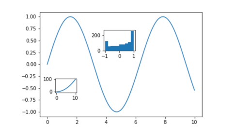

# Matplotlib intro


### Import Libs
```python
import numpy as np
import matplotlib.pyplot as plt

# 1000 points between 0 and 4*pi (12,5 aprox)
X = np.linspace(0,4*np.pi,1000)
Y = np.sin(X)

```

### Plot direclty on Frame
Show and save in png
```python
fig = plt.figure()
plt.plot(X, Y)
fig.save("basicFigure.png")
fig.show()
```

### Plot on Axes
```python
fig ,ax = plt.subplots()
pepe = ax.plot(X,Y)
fig.show()
```

### Scatter plot
By far, the most common
```python
# Generate RV numbers between 0 and 1, put them in Array
Random_Dist_X = np.random.uniform(0,1,1000)
Random_Dist_Y = np.random.uniform(0,1,1000)

fig ,ax = plt.subplots()
ax.scatter(Random_Dist_X, Random_Dist_Y)
ax.axis([-0.5,1.5,-0.5,1.5])
fig.show()


```

### Bar
Very used too
```python
import numpy as np

Range_X = np.arange(10)
# np to generate an array of 10 elements, random from lower to max
# np.random.uniform(lower, max, number)
Random_Uniform = np.random.uniform(7,23,10)
fig, ax = plt.subplots()
ax.bar(Range_X, Random_Uniform)
# Every element is an artist <BarContainer object of 10 artists>
# <BarContainer object of 10 artists>
fig.show()
```

### Add couple of axes
```python
# Original plot
fig = plt.figure()
plt.plot(time, height)
# First new axes
ax1 = fig.add_axes([0.43, 0.6, 0.15, 0.15])
ax1.hist(height, color='green')
# Second new axes
ax2 = fig.add_axes([0.2, 0.3, 0.1, 0.1])
ax2.plot(time, time**2)
fig.savefig('figures/figureAxes2.png')
plt.show()
```


### Subplots
Now we mix together

```python

# The basics

fig,ax = plt.subplots(1,2)
ax[0].bar(Range_X, Random_Uniform)
ax[1].scatter(Random_Dist_X, Random_Dist_Y)
fig.show()

# Play with the options of subplots

fig,ax = plt.subplots(1,2,figsize=(12,4))
ax[0].bar(Range_X, Random_Uniform)
ax[1].scatter(Random_Dist_X, Random_Dist_Y)
fig.show()

# weird figsize

fig,ax = plt.subplots(1,2,figsize=(2,22))
ax[0].bar(Range_X, Random_Uniform)
ax[1].scatter(Random_Dist_X, Random_Dist_Y)
fig.show()

# 2 x 2
fig,ax = plt.subplots(2,2)
ax[0,0].bar(Range_X, Random_Uniform)
ax[0,1].scatter(Random_Dist_X, Random_Dist_Y)
ax[1,0].bar(Range_X, Random_Uniform)
ax[1,1].scatter(Random_Dist_X, Random_Dist_Y)
fig.show()
# not bad ;)
```

Bigger Matrix:

```python
# Data
time = np.linspace(0, 10, 1000)
height = np.sin(time)
weight = np.cos(time)
# Plotting all the subplots
fig, axes = plt.subplots(2, 3)
axes[0, 0].plot(time, height)
axes[0, 1].plot(time, time**2)
axes[0, 2].hist(height)
axes[1, 0].plot(time, weight, color='green')
axes[1, 1].plot(time, 1/(time+1), color='green')
axes[1, 2].hist(weight, color='green')
plt.tight_layout()
plt.show()
```
###  Several plots, GridSpec

```python
time = np.linspace(0, 10, 1000)
height = np.sin(time)
weight = time*0.3 + 2
score = time**2 + height
distribution = np.random.normal(0, 1, len(time))

```
```python
from matplotlib.gridspec import GridSpec
fig = plt.figure(figsize=(10, 5))
gs = GridSpec(nrows=2, ncols=2)
ax0 = fig.add_subplot(gs[0, 0])
ax0.plot(time, height)
ax1 = fig.add_subplot(gs[1, 0])
ax1.plot(time, weight)
ax2 = fig.add_subplot(gs[:, 1])
ax2.plot(time, score)
ax3 = fig.add_axes([0.6, 0.6, 0.2, 0.2])
ax3.hist(distribution)
plt.show()
```

# Actors Layer

```python
from matplotlib.backends.backend_agg import FigureCanvasAgg as FigureCanvas
from matplotlib.figure import Figure
fig = Figure()
canvas = FigureCanvas(fig)
x = np.random.randn(10000)
ax = fig.add_subplot(111)
ax.hist(x, 100)
ax.set_title('Normal distribution with $\mu=0, \sigma=1$')
fig.savefig('matplotlib_histogram.png')
```

```python
import matplotlib.pyplot as plt
x = np.random.randn(10000)
plt.hist(x, 100)
plt.title(r'Normal distribution with $\mu=0, \sigma=1$')
plt.savefig('matplotlib_histogram.png')
plt.show()
```


